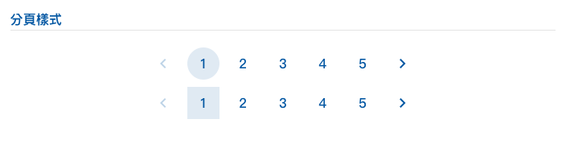

# 組件說明

?> 本範基於 Vuetify3 元件庫 開發 詳細說明請參考 [相關文件](https://vuetifyjs.com/en/#javascript)

<hr style="margin-bottom:3rem;"/>

### 標籤

</img>

?> 標籤組件 詳請請參考[文件連結](https://vuetifyjs.com/en/components/chip-groups/#usage)

引入元件

```vue
<template>
  <v-chip-group v-model="selection">
    <v-chip v-for="item in 6" :key="item" color="primary" link label> 標籤 </v-chip>
  </v-chip-group>
</template>
```

<hr style="margin-bottom:8rem;"/>

### 卡片

</img>

?> 卡片組件 詳請請參考 [文件連結](https://vuetifyjs.com/en/components/cards/#usage)

引入元件

```vue
<template>
  <v-card class="albumCard">
    <div class="cardContainer">
      <v-img src="~@/assets/demo/01.jpg" cover></v-img>
      <div class="info">
        <v-card-item>
          <v-card-title>資料標題</v-card-title>
          <v-card-subtitle>負責人/科別</v-card-subtitle>
          <p>資料內容記事資料內容記事資料內容記事...</p>
        </v-card-item>
        <v-card-text>
          <v-row class="iconList">
            <v-col>
              <v-icon icon="mdi:mdi-clock" />
              <span>112/03/27</span></v-col
            >
            <v-col class="d-flex justify-end">
              <v-icon icon="mdi:mdi-eye" />
              <span>112</span></v-col
            >
          </v-row>
        </v-card-text>
        <v-card-actions>
          <v-btn variant="tonal" color="primary" block> more </v-btn>
        </v-card-actions>
      </div>
    </div>
  </v-card>
</template>
```

<hr style="margin-bottom:8rem;"/>

### 按鈕

</img>

?> 按鈕組件 詳請請參考 [文件連結](https://vuetifyjs.com/en/components/buttons/#anatomy)

引入元件

```vue
<template>
  <div class="">
    <v-btn size="small" class="ma-1" color="primary"> Button </v-btn>
    <v-btn size="small" class="ma-1"> Button </v-btn>
    <v-btn size="small" class="ma-1" variant="outlined"> outlinedButton </v-btn>
    <v-btn size="small" class="ma-1" variant="tonal"> tonalButton </v-btn>
    <v-btn size="small" class="ma-1" variant="text"> textButton </v-btn>
    <v-btn size="small" class="ma-1" variant="plain"> plainButton </v-btn>
  </div>
</template>
```

<hr style="margin-bottom:8rem;"/>

### 分頁

</img>

?> 分頁組件 詳請請參考 [文件連結](https://vuetifyjs.com/en/components/paginations/#icons)

引入元件

```vue
<template>
  <div class="">
    <v-pagination v-model="page" :length="5" rounded="circle" active-color="primary" color="primary" size="small"></v-pagination>
    <v-pagination v-model="page" :length="5" rounded="0" active-color="primary" color="primary" size="small"></v-pagination>
  </div>
</template>
```

<hr style="margin-bottom:8rem;"/>

### 基本表單

</img>

?> 表單組件 詳請請參考 [文件連結](https://vuetifyjs.com/en/components/forms/#rules)

引入元件

```vue
<template>
  <v-form>
    <v-container>
      <v-row>
        <v-col cols="12">
          <v-text-field label="文字標準表單" hide-details="auto" density="compact"></v-text-field>
        </v-col>
        <v-col cols="12">
          <v-text-field label="文字標準表單" hide-details="auto" density="compact" :messages="['文字標準表單']"></v-text-field>
        </v-col>
        <v-col cols="12">
          <v-text-field label="文字標準表單" density="compact" hide-details="auto" error-messages="請填寫正確的格式"></v-text-field>
        </v-col>
      </v-row>
    </v-container>
  </v-form>
</template>
```

<hr style="margin-bottom:8rem;"/>

### 表格

</img>

?> 表格組件 詳請請參考 [文件連結](https://vuetifyjs.com/en/components/tables/#usage)

引入元件

```vue
<template>
  <div>
    <v-table>
      <thead class="bg-thead">
        <tr>
          <th class="text-left">表格標題</th>
          ...
        </tr>
      </thead>
      <tbody>
        <tr v-for="item in data" :key="item.name">
          <td class="text-center">表格內容</td>
          ...
        </tr>
      </tbody>
    </v-table>
  </div>
</template>
```

<hr style="margin-bottom:8rem;"/>
