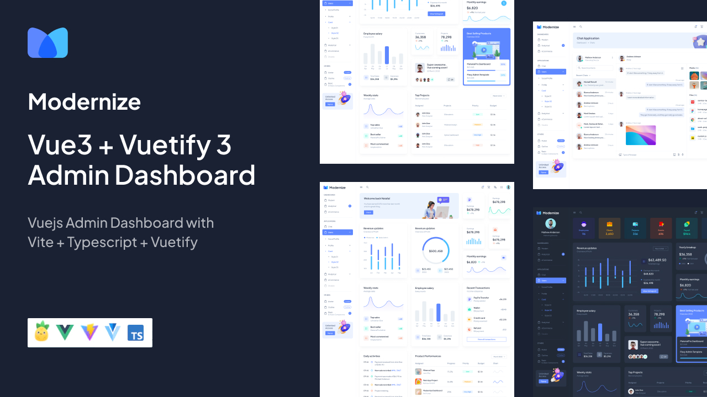

<!--  -->

### 關於 HyVue CMS

?> 此模板是由凌網科技-視覺設計部門共同開發，由 `HTML5`、`CSS3` 與 `JavaScript` 為核心語言開發而成，並使用最受歡迎的框架 Vuetify 構建。

HyVue CMS 附帶許多的頁面模板、儀表板、表格、圖表和表單示例等等。 
此模板是使用 `Vuetify 3 ` 及 `Vite` 建構的。 
 
HyVue CMS 頁面模板可以根據您的要求完全自訂。 

### 自定框架

?> 對於自訂，此框架需要了解 `Vue`、`SCSS` 和 `HTML`，以便能夠修改這些範本。
