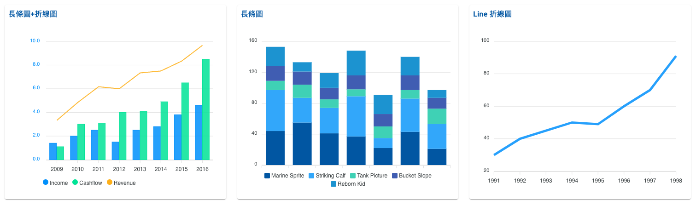
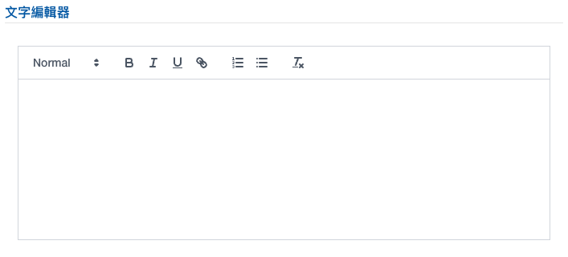
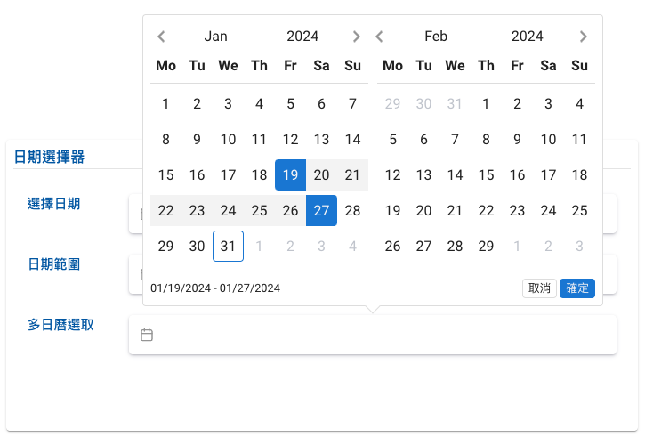

# 套件配置

## 動態效果 / GSAP 運用

?> 模板動態效果可參考 GSAP 或是其他相關套件 <br/>

模板運用效果 如: `animateNumber`效果 <br/>
相關設定 請詳閱 [GSAP](https://gsap.com/) 套件

在檔案中引入套件

```javascript
src / views / admin / defaultComponent.vue;
import gsap from 'gsap';
```

引入套件

```bash
npm install gsap
```

<hr style="margin-bottom:8rem;"/>

## 圖表 / ECharts 運用

?> 模板中圖表設定可參考 charts 或是其他相關圖表套件

相關圖表設定 請詳閱 [echarts.js](https://echarts.apache.org/zh/index.html) 套件 及[Vue-Echarts](https://vue-echarts.dev/) 套件

</img>

引入套件

```bash
npm install echarts
```

或是 引入套件

```bash
npm i echarts vue-echarts
```

引入元件

```vue
<template>
  <v-chart class="chart" :option="option" autoresize />
</template>
```

<hr style="margin-bottom:8rem;"/>

## 編輯器 / VueQuill 運用

</img>

?> 模板中樣式可參考 VueQuill 或是其他相關圖表套件

相關套件設定 請詳閱 [VueQuill](https://vueup.github.io/vue-quill/) 套件

在檔案中引入套件

```javascript
src / views / admin / fromComponent.vue;
import { QuillEditor } from '@vueup/vue-quill';
import '@vueup/vue-quill/dist/vue-quill.snow.css';
```

引入套件

```bash
npm install @vueup/vue-quill@latest
```

引入元件

```vue
<template>
  <quill-editor></quill-editor>
</template>
```

<hr style="margin-bottom:8rem;"/>

## 日期選擇器 / Vue Datepicker 運用

</img>

?> 模板中樣式可參考 Vue Datepicker 或是其他相關圖表套件

相關套件設定 請詳閱 [Vue Datepicker](https://vue3datepicker.com/props/modes/) 套件

在檔案中引入套件

```javascript
src / views / admin / fromComponent.vue;
import VueDatePicker from '@vuepic/vue-datepicker';
import '@vuepic/vue-datepicker/dist/main.css';
```

引入套件

```bash
npm install @vuepic/vue-datepicker
```

引入元件

```vue
<template>
  <VueDatePicker class="multiDatePicker"></VueDatePicker>
</template>
```
